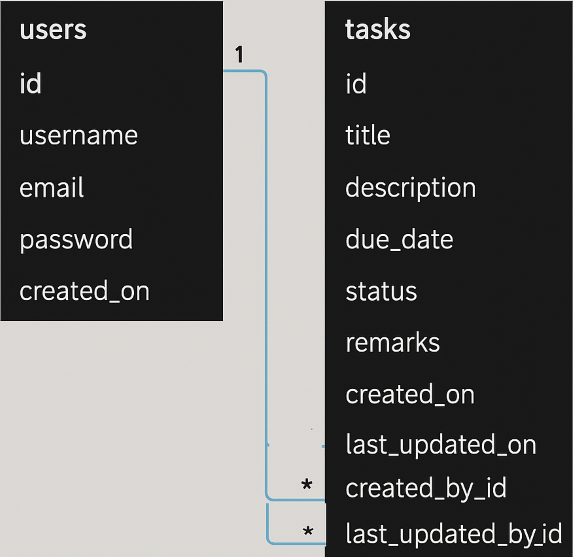

# Task_Management_System

# Overview

A full-stack task management application built with **React (Vite + TypeScript + Tailwind CSS)** on the frontend and **Spring Boot** on the backend. This system supports task CRUD operations, search, and user authentication.

---

## Features

- User Registration & Login
- Create, Read, Update, Delete (CRUD) Tasks
- Search Tasks by Keyword
- View Task Status, Deadlines, Remarks
- Timestamped Actions with Creator/Editor Metadata

---

## Technology Stack

### Frontend:
- React + TypeScript
- Vite
- Tailwind CSS
- Axios
- React Router

### Backend:
- Spring Boot (Java)
- Spring Security (Authentication)
- Spring Data JPA (ORM)
- RESTful API
- MySQL

---

## Database Design

### ER Diagram



### Tables Overview

#### `users` table
- `id`: Primary Key
- `username`: Unique username for the user
- `email`: User's email address
- `password`: Hashed password
- `created_on`: Timestamp of account creation

#### `tasks` table
- `id`: Primary Key
- `title`: Task title
- `description`: Detailed task description
- `due_date`: When the task is due
- `status`: Current status (e.g., pending, in-progress, completed)
- `remarks`: Any additional comments
- `created_on`: When the task was created
- `last_updated_on`: Last time the task was updated
- `created_by_id`: Foreign key referencing `users(id)`
- `last_updated_by_id`: Foreign key referencing `users(id)`

## How to Use

1. Clone the repository
2. Set up the MySQL database
3. Run the Spring Boot backend
4. Start the React frontend

### Data Dictionary

| **Entity** | **Attribute** | **Data Type** | **Description**                            |
| ---------- | ------------- | ------------- | ------------------------------------------ |
| User       | userId        | Long          | Unique identifier for the user             |
|            | username      | String        | Username of the user                       |
|            | email         | String        | User's email address                       |
|            | password      | String        | User's password (hashed)                   |
|            | createdAt     | LocalDateTime | Timestamp for when the user was created    |
| Task       | taskId        | Long          | Unique identifier for the task             |
|            | title         | String        | Title of the task                          |
|            | description   | String        | Description of the task                    |
|            | status        | String        | Task status (e.g., "Completed", "Pending") |
|            | createdAt     | LocalDateTime | Timestamp when the task was created        |
|            | updatedAt     | LocalDateTime | Timestamp when the task was last updated   |
|            | userId        | Long          | Foreign key to associate task with user    |

# Indexes:

-- Indexes can be added for columns like username (User), email (User), status (Task) to improve query performance.

### Design Approach

-- Code First approach has been used. This means the database schema is generated based on the entity classes defined in the code, allowing flexibility in managing and         evolving the database structure through code.

---

## Application Architecture

- **SPA (Single Page Application)** using React.
- **RESTful API** using Spring Boot to handle backend logic.

---

## Project Structure

```
task-management-system/
│
├── backend/ (Spring Boot)                                   # Spring boot
│   └── src/
│       ├── main/
│       │   ├── java/com/taskmanagement/
│       │   │   ├── TaskManagementApplication.java
│       │   │   ├── config/
│       │   │   │   └── SecurityConfig.java
│       │   │   ├── entity/
│       │   │   │   ├── User.java
│       │   │   │   └── Task.java
│       │   │   ├── repository/
│       │   │   │   ├── UserRepository.java
│       │   │   │   └── TaskRepository.java
│       │   │   ├── service/
│       │   │   │   ├── UserService.java
│       │   │   │   └── TaskService.java
│       │   │   └── controller/
│       │   │       ├── AuthController.java
│       │   │       └── TaskController.java
│       │   └── resources/
│       │       ├── application.properties
│       │       └── data.sql
│       └── pom.xml
│
├── frontend/ (React + Vite + Tailwind)                      # React app (Vite + Tailwind)
│   └── src/
│       ├── components/
│       │   ├── Layout.tsx
│       │   ├── Navbar.tsx
│       │   ├── TaskCard.tsx
│       │   └── TaskList.tsx
│       ├── pages/
│       │   ├── Dashboard.tsx
│       │   ├── CreateTask.tsx
│       │   ├── EditTask.tsx
│       │   ├── TaskDetail.tsx
│       │   ├── Login.tsx
│       │   └── Register.tsx
│       ├── services/
│       │   └── taskService.ts
│       ├── App.tsx
│       ├── main.tsx
│       ├── index.css
│       └── vite-env.d.ts


---

## Setup Instructions

### Prerequisites

- Node.js (v18+)
- Java JDK 17+
- MySQL/PostgreSQL
- Maven

### 🔧 Frontend Setup

```bash
cd frontend/
npm install
npm run dev
```

### Backend Setup

```bash
cd backend/
./mvnw spring-boot:run
```

### API Configuration

Update `axios` base URL in your frontend service (e.g., `taskService.ts`) to point to your backend API:
```ts
axios.defaults.baseURL = "http://localhost:8080/api";
```

---

## Deployment

- Use **Heroku**, **Render**, or **Vercel** for deploying frontend and backend separately.
- For production, configure **CORS**, **SSL**, and **Environment Variables** properly.

---

## ✅ User Acceptance Testing (UAT)

| Functionality           | Test Case                              | Expected Outcome                          |
|-------------------------|-----------------------------------------|-------------------------------------------|
| Register User           | Submit form with valid data             | Account created successfully              |
| Login                   | Submit valid credentials                | Token/session created, dashboard visible  |
| Create Task             | Fill and submit task form               | Task saved and shown in list              |
| Edit Task               | Modify task and save                    | Changes reflected                         |
| Search Task             | Enter keyword                           | Matching tasks filtered in list           |
| Delete Task             | Click delete on a task                  | Task removed from list                    |

---

## Notes

- You can include screenshots, sample test users, or a demo link (e.g., via ngrok or localtunnel) for reviewers.

---
